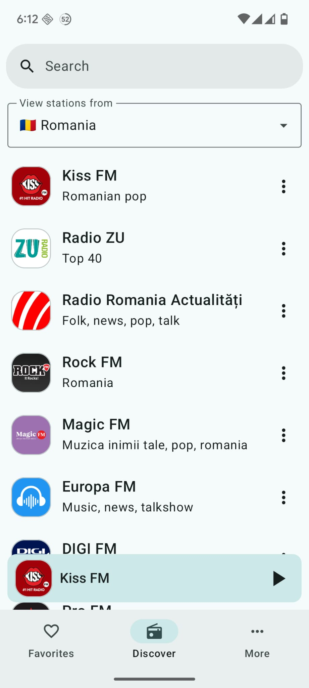
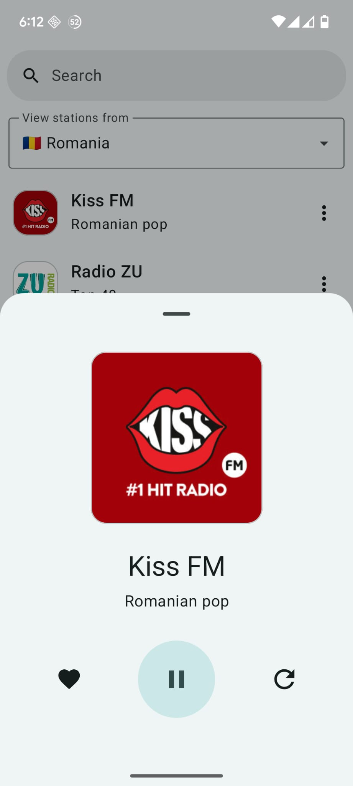
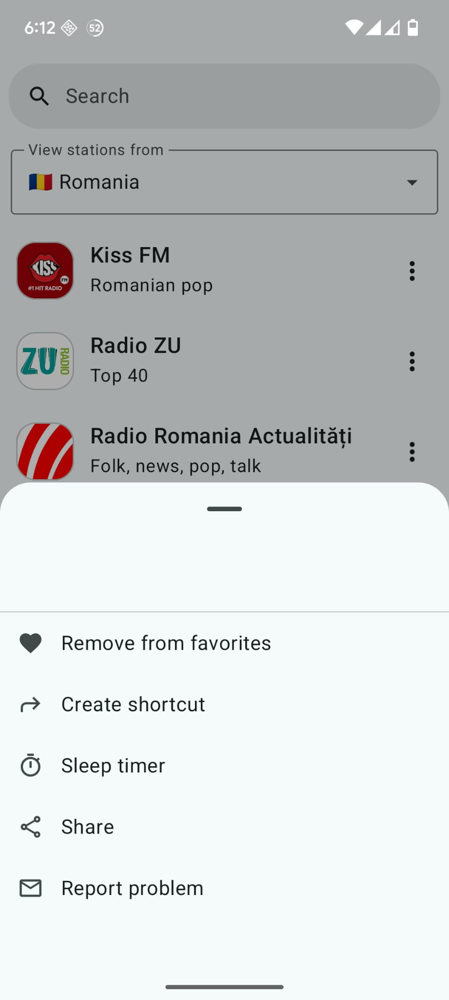

# RadioTime – Live FM & AM Radio App

**RadioTime** is a simple app that lets you listen to live radio stations from around the world. Whether you’re into music, talk, sports, or news, it gives you access to over **35,000 stations** in one place.

---

## About the project

RadioTime was one of my favorite projects to build. It helped me improve a lot as an Android developer.

The app is built entirely with **Jetpack Compose**, and follows the **MVVM** architecture. I used **Media3** for audio playback, **Room** for local storage (like favorites and custom stations), and **WorkManager** for background syncing. It also includes **Android Auto** support, **AdMob** for monetization, and **RevenueCat** for in-app purchases.

---

## Key features

- **Search by name** – Quickly find stations by typing their name  
- **Background playback** – Keep listening while using other apps or when the screen is off  
- **Sleep timer** – Automatically stop playback after a set time  
- **Favorites and shortcuts** – Save stations and pin them to your home screen  
- **Material You design** – The app follows your system’s theme and color palette  
- **Custom stations** – Add your own stream URL if it’s not already listed  
- **Android Auto support** – Use it safely while driving  
- **In-app purchases** – Upgrade to remove ads or support the app  
- **AdMob integration** – Ads are included by default and can be removed  

---

<h2>Download</h2>  
 

## Tech stack

- Kotlin  
- Jetpack Compose  
- Media3 (ExoPlayer)  
- Room Database  
- WorkManager  
- MVVM architecture  
- Material You  
- AdMob  
- RevenueCat (In-App Purchases)  
- Android Auto support  

---

## How to setup

1. Clone the repository and open it in Android Studio.
2. Open build.gradle.kts and add your AdMob App ID, Interstitial Ad ID, and RevenueCat API Key
3. Sync the project and build.

---

## Screenshots

  
  
  

## Why I'm making it open source

Google decided to remove RadioTime from Google Play because **one station** from the tens of thousands listed was streaming "inappropriate" content. That station was pulled from a public directory, like many others in the app, and obviously wasn’t handpicked.

Instead of letting me fix it or remove the problematic stream, they **suspended the entire app**. I appealed the decision, but nothing changed. This is just another example of how **Google doesn’t really support developers**, and how quick they are to take down apps without context or communication.

So I’m publishing the source code here to share the work I put into it, but also as a way to push back against that kind of treatment. Maybe someone finds it useful, maybe it inspires something better.

<h2>Contribute</h2>  
<a href="https://github.com/mattgdot/RadioStations">Update the repository with radio stations lists</a> 

