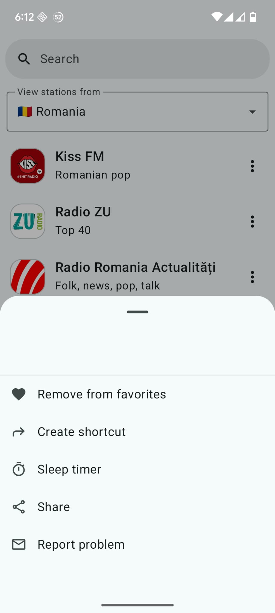

# 📻 SrivyaRadio – Global FM, AM & Internet Radio

SrivyaRadio is a feature-rich, open-source radio streaming application that brings you access to over **35,000+** live radio stations worldwide. Built with modern Android development practices, it offers a seamless audio experience with support for background playback, Android Auto, and offline functionality.

## 🌟 About

SrivyaRadio is designed to be the most comprehensive and user-friendly radio app on the Android platform. Whether you're looking for music, news, sports, or talk shows, SrivyaRadio connects you to thousands of stations across the globe with crystal-clear audio quality.

### Key Features:
- **Massive Library**: Access to 35,000+ radio stations worldwide
- **Modern UI**: Built with Jetpack Compose for a beautiful, responsive interface
- **Android Auto Support**: Full integration with Android Auto for safe listening while driving
- **Offline Mode**: Save your favorite stations for offline listening
- **Sleep Timer**: Fall asleep to your favorite station
- **No Ads**: Completely free with no annoying advertisements
- **Open Source**: Transparent development and community-driven improvements

---

## 📱 Highlights at a glance

- **[One‑tap discovery]** Browse curated categories, country folders, and powerful wildcard/field-based search (`MainViewModel.search()` and `DatabaseRepository.searchStations()`)
- **[Rich playback]** Media3 `PlayerService` powers background audio, now playing updates, queue management, shuffle/repeat, and auto-skip on stream failure (`PlayerService.kt`, `MainViewModel.kt`)
- **[Favorites ecosystem]** Save stations, pin launcher shortcuts, manage folders, and mirror everything into Android Auto (`MainViewModel.addOrRemoveFromFavorites()`, `PlayerService.updateCustomActions()`)
- **[Offline awareness]** Auto-detect dead streams, mark with red indicators, and advance to the next playable station (`MainViewModel.offlineStations`)
- **[Extended platforms]** Deep Android Auto integration with custom commands, country browsing, and favorite toggles (`PlayerService.MediaLibrarySessionCallback`)
- **[User personalization]** Import/export country lists, add custom station URLs, choose theme modes, and configure sleep timers (`MainViewModel`, `MoreScreen.kt`)
- **[Monetization ready]** AdMob banner/interstitial hooks and RevenueCat in-app purchase support (see `app/build.gradle.kts`, `MainActivity.onCreate()`)

---

## 🏗 Architecture & stack

- **Architectural pattern:** MVVM with flows/state holders in `MainViewModel` powering Compose UI
- **UI:** Jetpack Compose, Material 3, adaptive layout components under `ui/` package
- **Playback:** AndroidX Media3 ExoPlayer in a foreground service (`PlayerService.kt`) with `MediaBrowser` clients
- **Persistence:** Room (`data/`) for stations, favorites, recents; SharedPreferences for lightweight settings
- **Background work:** WorkManager tasks for syncing metadata and country lists
- **Platform services:** Android Auto browsing tree, RevenueCat purchases, AdMob ads

Key modules:

- **`MainActivity.kt`** – Hosts navigation graph and initializes purchases/ads
- **`MainViewModel.kt`** – Core state: discovery, favorites, search, queue, sleep timer, theme, imports
- **`PlayerService.kt`** – Media3 session, queue assembly, Android Auto commands, error recovery
- **`ui/screens/`** – Compose screens (Discover, Favorites, Player, More, Manage Countries, etc.)
- **`data/`** – Room entities/DAO/repositories and remote DTO mapping

---

## ✅ Feature matrix (selected)

- **Discover**: Country filter, infinite pagination, shimmer placeholders, offline badges
- **Search**: Wildcards (`*`, `?`), multi-field queries (`album: jailer`), local + remote data sources
- **Playback controls**: Shuffle, repeat cycle, queue view, compact mini-player, sleep timer service
- **Favorites**: Folder structure, launcher shortcuts, export/import, Android Auto sync
- **Recents & history**: Auto-save last played, quick resume, clearing and management tools
- **Customization**: Light/dark/auto theme, import/export CSV for custom countries, debug utilities
- **Android Auto**: Full browse tree (Discover, Favorites, Countries, Custom), custom actions for favorite toggle, shuffle, repeat, and player queue navigation
- **Monetization hooks**: RevenueCat placeholder key in `build.gradle.kts`, runtime guard for configuration, AdMob integration points ready for real IDs

---

## 🚀 Getting started

1. **Clone**: `git clone https://github.com/Srivyaa/SrivyaRadio.git`
2. **Open in Android Studio** (Giraffe+)
3. **Secrets**: Supply your credentials (or keep placeholders) before release builds
   - `app/build.gradle.kts`: replace `resValue("string", "app_id" ...)` etc.
   - `app/google-services.json`: add your Firebase config (ignored by Git)
   - RevenueCat key: update `resValue("string", "revcat_key", "<REAL_KEY>")`
4. **Sync & Run**: `./gradlew assembleDebug` or use the IDE run configuration
5. **Android Auto testing**: Deploy to head unit emulator or vehicle, grant notification/media permissions

Optional: Update `CountryList` or import CSV templates via the More screen to customize quick filters.

---

## 🖼 Screenshots

  
  
  

---

## 🤝 Contributing & acknowledgements

- **Report issues / feature ideas** via GitHub Issues
- **Pull requests** welcome — please include screenshots for UI changes
- **Radio station list**: contribute curated CSVs via <https://github.com/mattgdot/RadioStations>

Special thanks to the open-source community and original RadioTime inspiration. The project is shared to help others build rich media experiences despite app store setbacks.

---

## 🤝 Contributing

We welcome contributions from the community! Whether you're a developer, designer, or just have ideas, feel free to open an issue or submit a pull request. Please read our [contribution guidelines](CONTRIBUTING.md) before getting started.

## 📄 License

SrivyaRadio is licensed under the MIT License - see the [LICENSE](LICENSE) file for details.

## 📞 Contact

Have questions or feedback? Feel free to reach out to us at [your-email@example.com](mailto:your-email@example.com) or open an issue on our GitHub repository.

---

  Made with ❤️ for radio lovers around the world

This repository inherits the license specified in `LICENSE`. Review before redistribution or commercial use.

